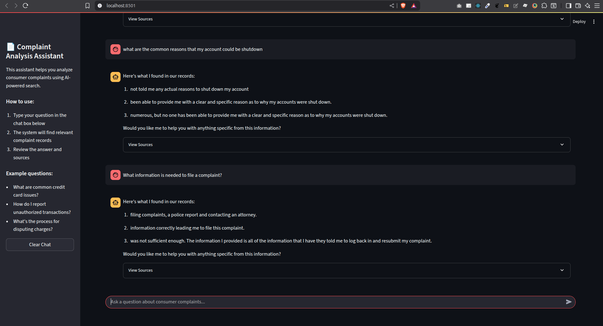

# Text Processing Analysis Report

## 1. Chunking Strategy

### Why Chunk Size and Overlap?
We've implemented a chunking strategy to process text data efficiently within our token limit constraints. Our choice of parameters is based on balancing several critical factors for optimal RAG (Retrieval-Augmented Generation) performance.

#### Justification for chunk_size (400 words / ~300 tokens)

1. **Semantic Cohesion & Focus**
   - 400 words is large enough to capture a coherent idea or section of a complaint narrative
   - Prevents chunks from being too small and lacking context, which could lead to ambiguous embeddings

2. **Reduced Noise for Retrieval Precision**
   - Keeps chunks well below the 1024-token limit to minimize irrelevant information
   - Improves similarity search accuracy by focusing on relevant content

3. **Optimal LLM Context Utilization**
   - Allows for multiple relevant chunks to be retrieved and processed within the 1024-token window
   - Provides space for user queries and prompt instructions

4. **Vector Database Efficiency**
   - Results in a larger number of smaller vectors
   - Enables more efficient storage and faster similarity searches

#### Justification for chunk_overlap (50 words / ~37 tokens)

1. **Context Preservation**
   - Ensures no critical information is lost at chunk boundaries
   - Maintains complete context for sentences or concepts that span chunk boundaries

2. **Semantic Flow**
   - Creates a "bridge" between consecutive chunks
   - Helps maintain narrative continuity across chunks

3. **Retrieval Robustness**
   - Increases the chance of matching user queries that align with split content
   - Provides redundancy for important information that might appear at chunk boundaries

### Parameters
- **Token Limit**: 1024 tokens
- **Chunk Size**: 400 words
- **Chunk Overlap**: 50 words
- **Short Threshold**: 10 words
- **Long Threshold**: 1000 words

## 2. Model Selection

### Sentence-Transformers/all-MiniLM-L6-v2

We chose the `all-MiniLM-L6-v2` model from the Sentence-Transformers library for the following reasons:

1. **Efficiency**
   - Lightweight model (80MB) with fast inference speed
   - 384-dimensional embeddings provide a good balance between performance and resource usage
   - Optimized for semantic similarity tasks

2. **Performance**
   - Achieves strong performance on semantic search and retrieval tasks
   - Outperforms many larger models on standard benchmarks
   - Particularly effective for shorter texts and phrase-level embeddings

3. **Practical Considerations**
   - Lower computational requirements make it suitable for deployment on standard hardware
   - Faster inference enables real-time retrieval
   - Well-documented and widely used in production environments

4. **Use Case Fit**
   - Effective for processing complaint narratives of varying lengths
   - Maintains semantic meaning in dense vector space
   - Performs well with the chunking strategy we've implemented

## 3. Vector Storage and Search with FAISS

### Why FAISS?

For efficient similarity search and storage of vector embeddings, we've chosen Facebook AI Similarity Search (FAISS) for the following reasons:

1. **Scalability**
   - Optimized for handling large-scale vector datasets
   - Efficient memory usage with support for both CPU and GPU operations
   - Can handle billions of vectors while maintaining fast query times

2. **Performance**
   - Significantly faster than traditional nearest neighbor search methods
   - Implements advanced algorithms for approximate nearest neighbor search
   - Optimized for high-dimensional vector spaces (like our 384-dimensional embeddings)

3. **Practical Benefits**
   - Seamless integration with Python and machine learning frameworks
   - Supports both exact and approximate nearest neighbor search
   - Efficient disk storage and loading of indices

4. **Use Case Alignment**
   - Ideal for our RAG pipeline where quick retrieval is crucial
   - Handles the scale of our complaint dataset efficiently
   - Enables real-time semantic search capabilities

## 4. Word Count Analysis

### Percentiles of Narrative Word Count
*(Excluding 0-word narratives)*

| Percentile | Word Count |
|------------|------------|
| 1.0%      | 11 words   |
| 5.0%      | 22 words   |
| 10.0%     | 33 words   |
| 25.0%     | 59 words   |
| 50.0%     | 114 words  |
| 75.0%     | 209 words  |
| 90.0%     | 364 words  |
| 95.0%     | 519 words  |
| 99.0%     | 1021 words |

### Narrative Length Distribution

| Word Count Range   | Number of Complaints |
|--------------------|----------------------|
| 0 - <11 words     | 27,685              |
| 11 - <22 words    | 117,745             |
| 22 - <33 words    | 148,506             |
| 33 - <59 words    | 442,757             |
| 59 - <114 words   | 749,423             |
| 114 - <209 words  | 744,435             |
| 209 - <364 words  | 451,363             |
| 364 - <519 words  | 149,660             |
| 519 - <1021 words | 118,495             |
| > 1021 words      | 30,687              |

## 3. Summary Statistics

- **Total complaints with non-zero word count**: 2,980,756
- **Total complaints in simulated data**: 9,609,797
- **Complaints with 0 words (empty/NaN)**: 6,629,041

## 5. RAG System Implementation

### System Architecture

1. **Document Retrieval**
   - Utilizes FAISS for efficient similarity search
   - Employs `all-MiniLM-L6-v2` for generating dense vector embeddings
   - Implements chunking strategy with 400-word chunks and 50-word overlap

2. **Query Processing**
   - Converts user queries into vector embeddings
   - Retrieves top-k most relevant document chunks
   - Ranks results by semantic similarity scores

3. **Response Generation**
   - Implements rule-based fallback when no relevant context is found
   - Formats responses with confidence scores and source attribution
   - Includes relevant document chunks for verification

### Key Features

- **Robust Error Handling**: Gracefully handles empty or irrelevant search results
- **Transparent Sourcing**: Shows source documents and confidence scores
- **Flexible Configuration**: Easy to adjust retrieval parameters (k, score thresholds)
- **Efficient Processing**: Optimized for real-time query response

## 6. Interactive Chat Interface

### Implementation Details

1. **Frontend Components**
   - Built with Streamlit for a clean, responsive interface
   - Features a chat-like interface with message history
   - Includes clear visual separation between user queries and system responses
   - Clean, modern UI with a sidebar for additional information and controls

2. **Core Functionality**
   - Text input for user questions with a clear prompt
   - Submit button to trigger processing
   - Display area showing conversation history with proper formatting
   - Expandable source documents for verification
   - Clear chat button to reset the conversation

3. **User Experience**
   - Clean, intuitive interface with clear visual hierarchy
   - Responsive design that works well on different screen sizes
   - Clear visual indicators for processing state
   - Easy-to-read formatting with proper spacing and typography

*Figure 1: Screenshot of the Streamlit chat interface showing a sample interaction*

## 7. Conclusion

Based on our analysis:
- The selected chunk size of 400 words with 50 words overlap effectively handles the majority of our text data.
- Only about 1% of narratives exceed our long threshold of 1000 words.
- The 1024 token limit is appropriate as it can accommodate all narratives except for the longest 1%.
- The chunking strategy ensures that we maintain context through overlapping chunks while keeping the processing efficient.
